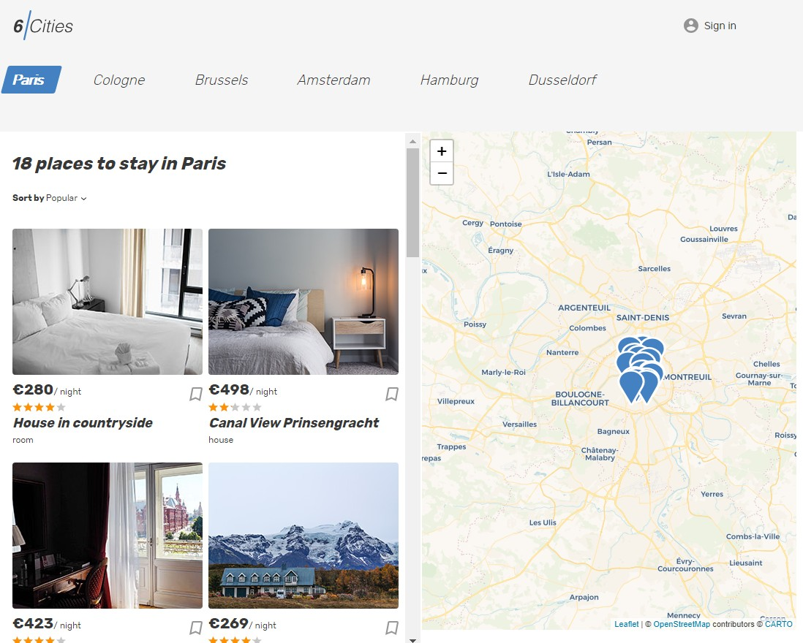

# Личный проект «Шесть городов»

## Ссылка на итоговый проект


**«Шесть городов» — сервис для путешественников, не желающих переплачивать за аренду жилья.** <br>
**Выбирайте один из шести популярных городов для путешествий и получайте актуальный список предложений по аренде.** <br>
**Подробная информация о жилье, показ объекта на карте, а также лаконичный интерфейс сервиса помогут** <br>
**быстро выбрать оптимальное предложение.**



## Установка

1. Создать Fork

2. Клонировать репозиторий на свой компьютер.

```git clone SSH-адрес_вашего_форка```

3. Установить пакеты npm.

```npm install```
